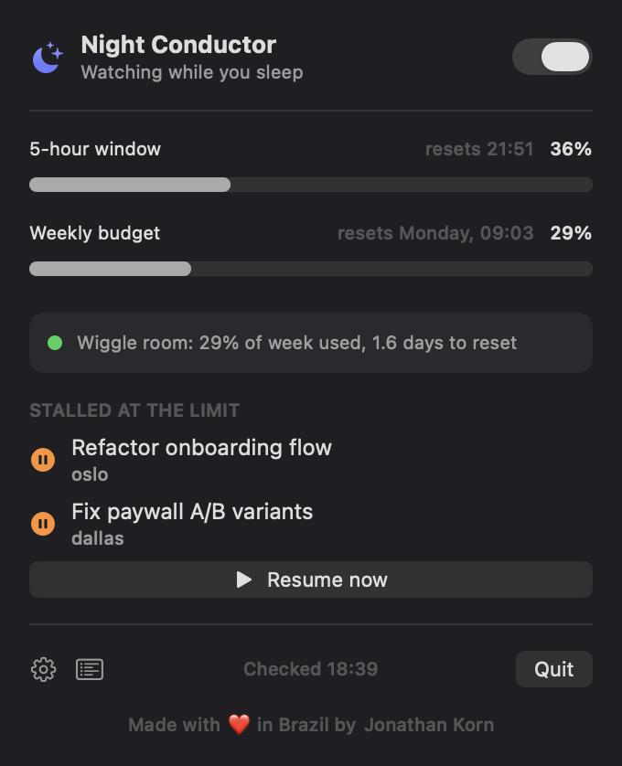

<p align="center">
  
</p>

<h1 align="center">Night Conductor</h1>

<p align="center">
  <strong>Your <a href="https://conductor.build">Conductor</a> sessions hit the Claude usage limit at 11pm.<br>
  Night Conductor finishes them while you sleep, without blowing your weekly budget.</strong>
</p>

<p align="center">
  
  
  
  
</p>

<p align="center">
  
</p>
<p align="center"><em>A moon lives in your menu bar. The header sky follows the real clock.</em></p>

---

It's midnight. You're a few prompts deep into something good, and Claude stops:
"You've hit your session limit, resets 1:30am." So you go to bed, and the work
just sits there until morning.

Night Conductor is a small macOS menu bar app that waits for exactly that.
While you sleep, it spots your stalled sessions, checks your live Claude usage,
and picks the work back up the moment your limit resets and there's budget to
spare. It presses the session's own Retry, so the chat stays in sync. You wake
up to finished work instead of a paused cursor.

It is careful with your tokens on purpose. During the day you're at the helm.
The night shift only takes over on the schedule you set, and it never spends
past the ceilings you give it.

## It works wherever you run Claude

Stalled sessions from all three places show up in one list, each one tagged by
where it came from and resumed the right way for that app.

| You run Claude in | Tag | How Night Conductor resumes it |
|-------------------|-----|--------------------------------|
| [Conductor](https://conductor.build) | `Conductor` | presses Conductor's own Retry, falls back to headless if that fails |
| The Claude desktop app (Cowork) | `Claude` | presses Claude Desktop's Retry, staying inside its sandbox |
| The terminal (Claude Code) | `Terminal` | runs `claude --resume` directly, which is exactly how you'd do it yourself |

If the same session shows up in more than one place, it only counts once.

## How the night goes

Every few minutes inside your watch window (23:00 to 07:00 by default):

1. **It scans.** Reads the session database (read only, it never writes back)
   for anything whose last message is a `429` usage-limit error.
2. **It checks the budget.** Asks the official usage endpoint for your live
   5-hour and weekly numbers, the same ones `/usage` shows in Claude Code,
   using the OAuth token Claude Code already keeps in your Keychain.
3. **It decides.** It only resumes when there's real room:
   - your 5-hour window is under the ceiling (85% by default)
   - your weekly window is under the stop line (90% by default)
   - you aren't burning the week faster than it's passing. If you're at 70%
     with five days left, it holds rather than make that worse overnight.
   - it leaves your mornings alone. You tell it when you're back (7:00 by
     default), and it won't start a session in the five hours before that, so a
     6am resume can't lock you out of your own window until 11am.
4. **It resumes.** It presses Retry so the work continues right in the chat.
   Resumes are spread across the night with a re-check after each one. It stops
   at 3 retries per session and 10 resumes a night. If it can't read your
   usage, it does nothing, because guessing is how you blow a budget.

## Install

You'll need macOS 15 or newer, [Conductor](https://conductor.build), and
[Claude Code](https://claude.com/claude-code) signed in with a subscription.

```bash
git clone https://github.com/jkkorn/Night-Conductor.git
cd Night-Conductor/NightConductor
./build-app.sh
```

Drag `dist/Night Conductor.app` into Applications and open it. That's it. Then:

1. Click the moon in your menu bar.
2. Flip the switch to arm the night watch.
3. Open settings and turn on Launch at login.
4. The first time, allow Keychain access (click Always Allow) and grant
   Accessibility so it can press Retry inside Conductor.

While the watch is armed and inside its window, Night Conductor keeps your Mac
awake on its own with a power assertion. No command, no password. If your Mac
is fully asleep before the window starts, open settings and tap Nightly wake to
schedule a firmware wake at your start hour.

## The interface

<p align="center">
  
  &nbsp;&nbsp;
  
</p>

- **Menu bar.** A moon next to your live 5-hour usage, so you can see how much
  room you have without opening anything.
- **Two meters.** Your 5-hour and weekly windows, with reset times.
- **The decision line.** Plain language about what it's doing and why. By day
  it reads "You're at the helm, night watch starts at 23:00." When it's clear
  to go, "Wiggle room: 29% of week used, 1.6 days to reset."
- **Stalled sessions.** Everything waiting at the limit, with a Resume now
  button that skips the schedule but still respects the budget.
- **Activity log.** What got done last night.

## During the day, too

The night window is the default, but stalls happen mid-afternoon as well.

Pin a session with the loop icon on its row and it resumes around the clock,
budget permitting, instead of waiting for night. Or hit Resume now, which goes
immediately and ignores the schedule and the budget gates. The only thing that
can stop a manual resume is Anthropic's actual limit.

Sessions you haven't pinned still wait for the night window, so a busy day
doesn't quietly drain your week.

## Morning summary and weekly stats

When the window closes, Night Conductor posts a one-line notification ("Resumed
3 sessions while you slept"). The share button renders a card of your week you
can drop straight into a post.

<p align="center">
  
</p>

## Raycast extension and CLI

There's a companion [Raycast](https://raycast.com) extension in
[`raycast/`](raycast/) with a menu-bar command for live usage and a list view
to resume stalled sessions. The same logic also ships as a zero-dependency
Python package for servers and tinkerers:

```bash
python3 -m autoconduct status     # usage, stalled sessions, decision
python3 -m autoconduct install    # launchd agent, ticks every 10 min
```

## Good to know

- It never writes to the session database. Anything a resumed turn changes
  lands in the workspace, where you can see it in Conductor's diff view.
- Overnight runs use Claude Code's `acceptEdits` mode. It can edit files, but
  not run commands you haven't approved.
- Your OAuth token is read from the Keychain per request. It's never stored or
  logged.
- Not affiliated with [Conductor](https://conductor.build) or Anthropic. I just
  use both a lot.

## FAQ

**Does the Conductor chat update when it resumes?**
Yes. By default it presses the session's own Retry through the Accessibility
API, so the conversation continues in place. If that fails it falls back to a
headless `claude --resume`. The work still lands in the workspace, but the chat
keeps showing the old error banner until you reopen it.

**I granted Accessibility but it still shows the orange warning.**
If you build the app yourself, every rebuild gets a new ad-hoc signature and
macOS quietly ignores the old grant. Run
`tccutil reset Accessibility app.night-conductor` and grant it again, or remove
and re-add it under System Settings, Privacy & Security, Accessibility.

**The popover keeps closing on its own.**
A menu bar manager like Ice or Bartender with auto-rehide will close any open
menu bar popover when it hides. Pin Night Conductor to the always-visible
section.

## About

Made with love in Brazil by [Jonathan Korn](https://www.linkedin.com/in/jkkorn).
I built it for [Conductor](https://conductor.build), an app I genuinely love,
because I kept hitting my limit at midnight and wanted the work to keep going
while I slept. If it saved your night, you can
[buy me a coffee](https://buymeacoffee.com/jkkorn).

## License

MIT. See [LICENSE](LICENSE).
