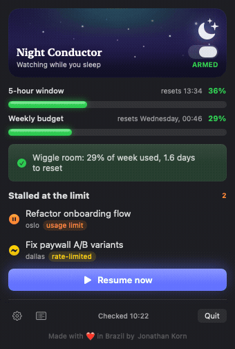
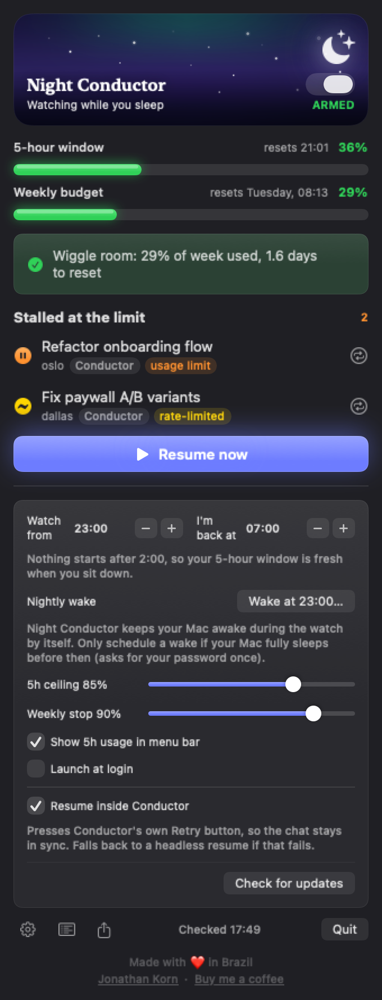

<p align="center"></p>

# 🌙 Night Conductor

**Your [Conductor](https://conductor.build) sessions hit the Claude usage limit at
11pm. Night Conductor resumes them while you sleep — without blowing your
weekly budget.**

<p align="center"></p>
<p align="center"><em>The header is a living sky that follows the real clock — dusk, midnight, dawn.</em></p>

A tiny macOS menu bar app. A moon lives in your menu bar. While you sleep, it
watches your stalled Conductor sessions and your live Claude usage, and resumes
work the moment there's budget headroom. You wake up to finished tasks.

## How it works

Every 10 minutes during your sleep window (default 23:00–07:00):

1. **Scan** — reads Conductor's session database (strictly read-only) for
   sessions whose last message is a 429 *"You've hit your usage limit"* error.
2. **Budget check** — queries the official usage endpoint (the same numbers
   `/usage` shows in Claude Code) for your live 5-hour and weekly utilization,
   using the OAuth token Claude Code already keeps in your Keychain.
3. **Gate** — resumes only when it's actually safe:
   - 5-hour window below the ceiling (default 85%)
   - weekly window below the stop line (default 90%)
   - **weekly pacing**: if you've consumed more of your week than the time
     that has elapsed (plus a 15-point margin), it holds. 70% used with five
     days left? It won't make that worse overnight.
   - **morning protection**: you tell it when you're back at your computer
     (default 7:00). It never starts a session within 5 hours of that — a
     6am resume would anchor a usage window that locks *you* out until 11am.
     The night shift stands down at 2:00 so your window is fresh at 7:00.
4. **Resume** — runs `claude --resume` headlessly in each session's workspace,
   one at a time, re-checking the budget after every run. Caps: 3 retries per
   session, 10 resumes per night. If usage can't be determined, it never
   resumes (fail closed).

## Install (the for-dummies path)

Requirements: macOS 14+, [Conductor](https://conductor.build), and
[Claude Code](https://claude.com/claude-code) logged in with a subscription.

```bash
git clone https://github.com/jkkorn/Night-Conductor.git
cd Night-Conductor/NightConductor
./build-app.sh
```

Drag `dist/Night Conductor.app` into **Applications** and open it.
That's the whole install. Then:

1. Click the 🌙 in your menu bar.
2. Flip the switch to arm the night watch.
3. In settings (⚙): enable **Launch at login**.
4. First run only: macOS asks to allow Keychain access — click **Always Allow**.

### Staying awake at night

Night Conductor **keeps your Mac awake by itself** while the watch is armed and
in its window (a power assertion — no command, no password). So if your Mac is
on when you go to bed, you're done.

If your Mac is *fully asleep* before the watch starts, the firmware has to wake
it — open settings (⚙) and tap **Nightly wake** (it uses your start hour and
asks for your password once). No hardcoded command, and it follows whatever
hours you set.

## The interface

<p align="center"></p>

- **Menu bar** — the moon sits next to your live 5-hour usage %, so you can
  glance at how much room you have without opening anything (toggle in settings).
- **Two meters** — your live 5-hour window and weekly budget, with reset times.
- **Decision line** — exactly why it will or won't resume right now
  ("Wiggle room: 29% of week used, 1.6 days to reset").
- **Stalled sessions** — every session waiting at the limit, and a
  **Resume now** button that skips the schedule but never the budget gates.
- **Activity log** — what got conducted last night.

## Headless / CLI version

The same logic ships as a zero-dependency Python package for servers and
tinkerers — see [`autoconduct/`](autoconduct/):

```bash
python3 -m autoconduct status     # usage, stalled sessions, decision
python3 -m autoconduct install    # launchd agent, ticks every 10 min
```

## Raycast extension

A companion [Raycast](https://raycast.com) extension lives in
[`raycast/`](raycast/): a menu-bar command for live usage + stalled count,
and a list view to resume stalled sessions — reading the same Conductor DB
and usage endpoint.

```bash
cd raycast && npm install && npm run dev
```

It's a companion, not a replacement: the unattended overnight watching stays
in the menu bar app; Raycast gives you the quick glance and manual resume.

## Good to know

- **Read-only by design.** Night Conductor never writes to Conductor's
  database. Resumed turns run headlessly, so they won't appear in Conductor's
  chat UI — but every file change and commit lands in the workspace, visible
  in Conductor's diff view.
- Overnight runs use Claude Code's `acceptEdits` permission mode: edit files
  yes, arbitrary unapproved commands no.
- Your OAuth token is read from the Keychain per-request and never stored or
  logged.
- Not affiliated with [Conductor](https://conductor.build) or Anthropic —
  just built with love by a heavy user.

## FAQ

**The chat in Conductor updates when Night Conductor resumes?**
Yes — by default it resumes *inside* Conductor by pressing the session's own
Retry button via the Accessibility API (grant access when prompted). If that
fails for any reason, it falls back to a headless `claude --resume`: the work
still lands in the workspace, but the chat shows a stale error banner.

**I granted Accessibility access but it still shows the orange warning.**
If you built the app yourself, each rebuild gets a new ad-hoc code signature
and macOS silently ignores the old grant. Remove Night Conductor from
System Settings → Privacy & Security → Accessibility (− button) and re-add
it, or run `tccutil reset Accessibility app.night-conductor` and grant again.

**The popover keeps closing by itself.**
A menu bar manager (Ice, Bartender) with auto-rehide will close any open
menu bar popover when it rehides. Pin Night Conductor to the always-visible
section, or increase the rehide interval.

## About

Made with ❤️ in Brazil by [Jonathan Korn](https://www.linkedin.com/in/jkkorn).
Built because I love [Conductor](https://conductor.build) and kept hitting my
limits at midnight.

## License

MIT
